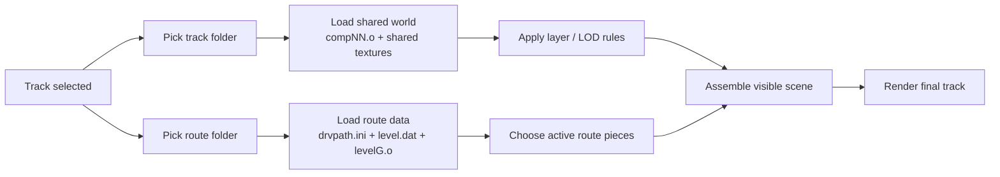

# NFSHP2 Track Rendering Wiki

## 1. What A "Track" Is In HP2

Need for Speed: Hot Pursuit 2 does not render a track from one monolithic map file.

A playable track is assembled at runtime from:

- one shared name under `tracks/<Name>/`
- one selected route folder under `tracks/<Name>/levelXX/`
- per-compartment world geometry in `compNN.o`
- route-specific geometry in `levelG.o`
- route metadata in `drvpath.ini` and `level.dat`
- texture banks in `.viv` and `.fsh`
- a layer-state system that distinguishes normal layers from `*LOD` layers

That is why simple exporters often show:

- all route ramps at once
- large LOD cover meshes over the road
- multiple overlapping layer passes

The original game does more runtime selection than `otools` does.


## 2. Runtime Rendering Pipeline

High-level view only. The detailed behavior stays in Section 3.


 

## 3. The Pipeline, Step By Step

### Step 1: The game picks a theme folder

Playable track ids are defined in [Tracks.ini](/Users/nurupo/Desktop/nfshp2/tracks/Tracks.ini).

Example:

- `track9` uses theme `Medit`
- `track6` uses theme `Alpine`

This only chooses the shared world set. It does not fully define the final route.


### Step 2: The game picks a route folder inside that theme

Each theme contains six route folders:

- `level00`
- `level01`
- `level02`
- `level03`
- `level04`
- `level05`

These are not six unrelated maps. They behave like route variants inside the same theme.

From `drvpath.ini`, you can see the forward/reverse pairings. For Medit:

- `level00` and `level03` are a pair
- `level01` and `level04` are a pair
- `level02` and `level05` are a pair

The route folder contributes:

- `drvpath.ini`
- `level.dat`
- `levelG.o`
- `level.fsh`
- `lighting.ini`
- `aipaths.dat`
- `level.rob`


### Step 3: The game loads route order from `drvpath.ini`

Executable evidence:

- `nfshp2.exe` references `drvpath.ini` at `0x438b1f`
- nearby strings include `compartmentId`, `nodenum`, and `startNode`

This is the file that tells the game which base compartments are relevant for the chosen route, and in what order.

Example from Medit:

- `level00` compartments: `5, 9, 10, 11, 12, 13, 14, 15, 16, 17, 6`
- `level03` compartments: `5, 6, 17, 16, 15, 14, 13, 12, 11, 10, 9`

So the route is not "all compartments all at once". The route folder declares a path through the shared theme world.

Render-side executable evidence supports that interpretation. Around `0x439810` to `0x43998e`, the game calls the layer render helpers for selected route entries, not for every compartment in the theme. One branch iterates a full route/render-entry list. Another branch computes current/neighbor route entries and calls the render helpers for three entries. A third path calls the normal-layer-only helper for one current route entry.

The current/neighbor path is circular at route seams. The helper at `0x439b50` maps the current route ordinal to the next ordinal and wraps the last ordinal back to `0`. The helper at `0x439c00` maps the current route ordinal to the previous ordinal and wraps `0` back to `count - 1`. For Medit `level00`, route index `0` therefore renders the compartment window `[6, 5, 9]`, not just `[5, 9]`.

Further disassembly around `0x4396a0` shows the route-transition/update path touches a wider neighborhood than that immediate render window. When the stored route ordinal changes, it updates/unloads the old `current - 2`, `current - 1`, `current`, `current + 1`, and `current + 2` wrappers, then initializes the new previous/current/next wrappers. The main render path above still has the clearest direct evidence for current/previous/next render calls, but a debug renderer that only activates a strict `±1` window can miss geometry at transition edges because it does not model the original wrapper update/prefetch state separately.

The helper calls found there are:

- `0x437870`, for opaque and optional `opaqueLOD`
- `0x437980`, for alpha and optional alpha LOD
- `0x437c60`, for normal layers only

The exact current-node calculation still needs more reverse engineering, but the important behavior is already clear: the original renderer uses `drvpath.ini` route records to choose which compartment wrappers are rendered for the current route context. It does not treat a theme folder as one always-visible mesh.


### Step 4: The game loads shared compartment models

Executable evidence:

- `nfshp2.exe` contains the format string `%s%s\\comp%02d.o`

This matches the base world files:

- `comp01.o`
- `comp02.o`
- `comp04.o`
- ...

Each `compNN.o` is a shared chunk of the world, not a full route by itself.

The matching `compNN.viv` files are the texture/resource sidecars for those chunks.


### Step 5: The game resolves model layers and `mLayersStates`

This is the key mechanism that exporters usually miss.

Using the model layout from [export.cpp](/Users/nurupo/Desktop/dev/otools/OTools/export.cpp), the relevant fields are:

```c
typedef struct Model {
    /* ... */
    uint32_t mNumLayers;        // +0x9c
    const char **mLayerNames;   // +0xa0
    uint32_t field_A4;
    void *field_A8;
    void *field_AC;
    void *mNext;
    const char *mName;
    void *pInterleavedVertices;
    void *mTextures;
    uint32_t mVariationID;      // +0xc0
    void *mLayersStates;        // +0xc4
    uint32_t mIsRenderable;     // +0xc8
    void *mLayers;              // +0xcc
} Model;
```

Confirmed executable behavior:

- function `0x54e040` loops over `mLayerNames`
- it compares the requested layer name string against `mLayerNames[i]`
- when it finds a match, it returns a pointer inside `mLayersStates`
- specifically, it returns `mLayersStates + 4 + i * 4`

That proves:

- `mLayersStates` is parallel to `mLayerNames`
- it stores one 32-bit state entry per layer
- there is a 4-byte header or prefix before the first returned state slot

The engine also builds a canonical world-layer lookup table. At `0x43737f` to `0x43742b`, it resolves these names in order:

- `opaque`
- `alpha1`
- `alpha2`
- `alpha3`
- `alpha4`
- `alpha5`
- `opaqueLOD`
- `alpha1LOD`
- `alpha2LOD`
- `alpha3LOD`
- `alpha4LOD`
- `alpha5LOD`

This is why layers like `opaqueLOD` are not exporter inventions. They are first-class runtime layer categories in the game.

Observed Medit values from `comp*.o`:

- `opaque -> 0x1fff9`
- `opaqueLOD -> 0x10004`
- `alpha2 -> 0x1000f`
- `alpha2LOD -> 0x1001a`

For larger layer sets, the values continue in a regular stepped pattern.

Confirmed render behavior:

- function `0x4377d0` clears all cached layer states by writing `0` to the high word of each layer-state slot
- function `0x54e390`, the model renderer, checks that same high word before rendering a layer
- if the high word is `0`, the renderer skips the whole layer
- if the high word is non-zero, the layer is eligible to render

For example, a state value like `0x00010005` has an active high word of `0x0001`. Clearing it produces `0x00000005`, which keeps the low selector/id but disables that layer for the render call.

What is already certain:

- the game distinguishes normal and LOD layers explicitly
- exporting every layer blindly will show geometry that the game does not enable at the same time
- `opaqueLOD` and `alpha*LOD` are enabled by runtime layer-state changes, not by separate files or exporter-only names


### Step 5b: The game switches layers immediately before rendering

The track-world render wrapper stores cached pointers for the canonical layer slots:

- `+0x54` -> `opaque`
- `+0x58` to `+0x68` -> `alpha1` to `alpha5`
- `+0x6c` -> `opaqueLOD`
- `+0x70` to `+0x80` -> `alpha1LOD` to `alpha5LOD`

The executable uses three important render helpers:

- `0x437870`
  Clears all layer states, optionally enables `opaqueLOD`, then enables `opaque`, calling the model renderer for the enabled passes.
- `0x437980`
  Clears all layer states, enables visible alpha layers, and enables alpha LOD layers only when its LOD argument allows it.
- `0x437c60`
  Clears all layer states, then enables only the six normal slots from `opaque` through `alpha5`. It does not enable any `*LOD` layers.

This means the original game is not rendering a static model where `opaque`, `alpha`, and `*LOD` layers are all on. It makes a layer-state decision for each render call.


### Step 6: The game loads route-specific selection data from `level.dat`

Executable evidence:

- `nfshp2.exe` references `level.dat` at `0x4d9153`
- the loader/parser starts at `0x4d8080`

The important point is that `level.dat` is not a random blob. The executable parses it as a counted multi-table binary file.

For Medit, the parser expects these table sizes, in order:

1. `0x24`
2. `0x14`
3. `0x78`
4. `0x38`
5. `0x44`
6. `0x74`
7. `0x10`
8. `0x24`
9. `0x0c`

Across the sampled track themes:

- tables 1 to 4 are always populated
- tables 5 to 7 are zero-count in all sampled track `level.dat` files
- table 8 is usually small
- table 9 is often large

For Medit:

- `level00`: `[206, 24, 21, 24, 0, 0, 0, 1, 411]`
- `level01`: `[207, 25, 22, 25, 0, 0, 0, 3, 527]`
- `level02`: `[206, 24, 21, 24, 0, 0, 0, 1, 654]`


### Step 7: `level.dat` selects which route objects are active

The most important render-side table inside `level.dat` is table 4, the `0x38` record table.

Those records start with six-digit ids like:

- `000142`
- `000195`

Those ids match `levelft.000XYZ` model names inside `levelG.o`.

So the route logic is:

- `levelG.o` contains a pool of route objects
- `level.dat` says which `levelft` models are active
- the game does not render all route pieces at once

This is the main reason a naive export showed:

- all ramps at once
- mutually exclusive closures
- route blockers that should not coexist


### Step 8: The game loads `levelG.o` after `level.dat`

Executable evidence:

- the loader builds `level%s`
- then loads `levelG.o` at `0x4d94ed`

This order matters:

1. parse route selection data from `level.dat`
2. load `levelG.o`
3. activate the subset that belongs to the chosen route

So `levelG.o` is not the full final route by itself. It is a source pool that is filtered by route data.


### Step 9: Textures come from both shared and route-local archives

Shared theme resources:

- `compNN.viv`
- `persist.viv`
- `trackenv.fsh`
- `staticenvmap.fsh`

Route-local resources:

- `level.fsh`

So the final scene is a merge of:

- shared geometry + shared textures
- route-specific geometry + route-specific textures


### Step 10: Global render policy is separate from route selection

Executable evidence:

- `nfshp2.exe` loads `%sEAGL\\LOD.ini` at `0x436980`
- it selects one of `max`, `high`, `med`, `low`, or `off`

Confirmed file contents from [LOD.ini](/Users/nurupo/Desktop/nfshp2/EAGL/LOD.ini):

- `sun.doRender`
- `shadows.allowStencil`
- `shadows.allowSplat`
- skid mark flags
- car/world particle settings

This file clearly controls global render quality and effects.

Important limitation:

- it does not, by itself, fully explain route-piece selection
- route-piece selection is driven by the route folder and `level.dat`
- it does not contain per-compartment, per-primitive, or world-layer LOD rules

The executable also gates LOD-layer rendering with a global detail/view setting. In the route render caller, an argument passed into `0x437870` and `0x437980` is derived from a global option check equivalent to `global_option_at_0x94c > 1`. That argument decides whether `opaqueLOD` and `alpha*LOD` are allowed for that render call.

The exact UI name for that global option has not been mapped yet, so do not document it as a specific menu setting without further work. The useful fact is narrower: the LOD layer switch is a runtime render-call flag, while `EAGL/LOD.ini` is a global effects/detail config file.


## 4. Medit `comp09:opaque_prim_005`

This case is useful because it proves why a raw export can disagree with the original game.

Observed file data:

- source compartment: [comp09.o](/Users/nurupo/Desktop/nfshp2/tracks/Medit/comp09.o)
- model: `trackft`
- layer: `opaque`
- primitive: `opaque_prim_005`
- shader: `BlendedOverlay`
- textures: `0072`, `0118`, `0119`
- vertices: `639`
- triangles: `470`
- disconnected triangle components: `89`
- bounding box: `(187.66, 29.22, -1021.52)` to `(526.6, 232.54, -267.94)`

Important conclusions:

- `opaque_prim_005` is not in `opaqueLOD`; it is a normal `opaque` primitive.
- It is not a single clean road-blocking object. It contains many disconnected terrain pieces inside one render primitive.
- Deleting the whole primitive removes terrain that the other side of the route needs, which explains the holes.
- The old-format first word beside the render descriptor, observed as `0xa000ffff`, is not a per-primitive visibility rule. It is constant across the relevant layer entries checked for `comp09`.

For Medit `comp09`, the layer-state words include:

- `opaque -> 0x00010005`
- `opaqueLOD -> 0x00010010`
- `alpha1LOD -> 0x0001001b`
- `alpha2 -> 0x00010026`
- `alpha2LOD -> 0x00010031`

The original game can disable a layer for a render call by clearing the high word. For example, clearing `opaque` turns `0x00010005` into `0x00000005`.

However, because `opaque_prim_005` is part of the normal `opaque` layer, the original game is not hiding it by an `opaqueLOD` layer switch. The more relevant behavior is route-aware compartment selection: the renderer does not draw every Medit compartment from every route-side context. A raw export/viewer that renders all of `comp09` without the original route-neighborhood selection can expose bundled terrain from the wrong side, including terrain that appears to block the road.


## 5. What This Means For Exporters

`otools` gives the correct model layout, but it does not reproduce HP2's full runtime track assembly.

If an exporter simply dumps every layer from every `.o`, it will tend to show:

- `opaque` and `opaqueLOD` together
- multiple alpha passes together
- all route alternatives from `levelG.o`
- overlapping surfaces that the game keeps separate at runtime

The minimum track-specific logic needed for a usable export is:

1. choose one theme folder
2. choose one route folder
3. parse `drvpath.ini`
4. load the shared `compNN.o` set
5. parse `level.dat`
6. filter `levelG.o` by the `levelft` ids in `level.dat`
7. keep shared and route-local texture banks separate
8. reproduce the layer-state activation behavior instead of enabling every layer at once
9. reproduce route-neighborhood compartment selection instead of drawing every compartment from every view context


## 6. Track Folder Structure

The runtime pipeline above maps directly onto the folder layout.

```text
tracks/
|-- Tracks.ini
|-- Alpine/
|-- Medit/
|-- Parkland/
`-- Tropics/
```

Theme folder example:

```text
tracks/Medit/
|-- comp01.o
|-- comp01.viv
|-- comp02.o
|-- comp02.viv
|-- ...
|-- comp33.o
|-- comp33.viv
|-- persist.viv
|-- trackenv.fsh
|-- staticenvmap.fsh
|-- upload.o
|-- Tr.ini
|-- Fog.ini
|-- info.ini
|-- sun.ini
|-- contrast.ini
|-- TrCam.ini
|-- TrMusic.ini
|-- audio.ini
|-- audiopts.ini
|-- audtrigs.ini
|-- boom.ini
|-- verb.ini
|-- track.bnk
|-- level00/
|-- level01/
|-- level02/
|-- level03/
|-- level04/
`-- level05/
```

Route folder example:

```text
tracks/Medit/level00/
|-- drvpath.ini
|-- level.dat
|-- levelG.o
|-- level.fsh
|-- aipaths.dat
|-- lighting.ini
`-- level.rob
```

File roles:

- `Tracks.ini`
  Maps playable track ids to a base theme folder.
- `compNN.o`
  Shared theme geometry compartments.
- `compNN.viv`
  Shared textures/resources for those compartments.
- `persist.viv`
  Shared theme-wide texture/resource bank.
- `trackenv.fsh`, `staticenvmap.fsh`
  Shared environment texture banks.
- `drvpath.ini`
  Route compartment order and route start metadata.
- `level.dat`
  Route selection data, including the `levelft` ids used to filter `levelG.o`.
- `levelG.o`
  Route-specific geometry/object pool.
- `level.fsh`
  Route-specific textures.
- `aipaths.dat`
  AI route/path data.
- `lighting.ini`
  Route-local lighting data.
- `level.rob`
  Additional route-side binary asset; not yet decoded here.


## 7. `level.dat` Binary Structure

The old "front half plus unknown tail" summary is not accurate enough.

The executable parses `level.dat` as a nine-table file.

### On-disk layout

```text
level.dat
|-- u32 table0_count
|-- table0[table0_count]              // 0x24 each
|-- u32 table1_count
|-- table1[table1_count]              // 0x14 each
|-- u32 table2_count
|-- table2[table2_count]              // 0x78 each
|-- u32 table3_count
|-- table3[table3_count]              // 0x38 each
|-- u32 table4_count
|-- table4[table4_count]              // 0x44 each
|-- u32 table5_count
|-- table5[table5_count]              // 0x74 each
|-- u32 table6_count
|-- table6[table6_count]              // 0x10 each
|-- u32 table7_count
|-- table7[table7_count]              // 0x24 each
|-- u32 table8_count
`-- table8[table8_count]              // 0x0c each
```

For sampled track files:

- tables 4 to 6 are present in the parser but zero-count on disk
- table 7 and table 8 are real and should not be treated as generic tail bytes


### Table 0: transform/placement records

High confidence:

- size is `0x24`
- the first 7 values are 7 floats
- they read naturally as quaternion + position

Observed Medit values:

- quaternion-like rotation
- position-like world coordinates
- `0xFFFF0000` in the 8th dword
- small integer id in the 9th dword

Example struct:

```c
typedef struct LevelPlacementRecord {
    float rot_x;
    float rot_y;
    float rot_z;
    float rot_w;
    float pos_x;
    float pos_y;
    float pos_z;
    uint32_t flags;       // observed as 0xFFFF0000 in sampled Medit files
    uint32_t object_id;   // small integer id
} LevelPlacementRecord;   // 0x24
```


### Table 1: link records

High confidence:

- size is `0x14`
- the first two dwords look like parent/child indices
- the remaining three dwords are usually `-1`

Example struct:

```c
typedef struct LevelLinkRecord {
    uint32_t parent_index;
    uint32_t child_index;
    int32_t unk_08;   // usually -1
    int32_t unk_0C;   // usually -1
    int32_t unk_10;   // usually -1
} LevelLinkRecord;    // 0x14
```


### Table 2: named route-object descriptors

High confidence:

- size is `0x78`
- this table contains names such as:
  - `sign`
  - `table`
  - `chair`
  - `helicopter`
  - `blades_main`
  - `blades_tail`
  - `spikestrip1`
  - `spikestrip2`
  - `Tbarrel1` to `Tbarrel5`
  - `smokebar`

Important detail:

- there is one string slot at offset `0x00`
- there is another string slot at offset `0x50`

Example partial struct:

```c
typedef struct LevelNamedObjectRecord {
    char primary_name[0x14];
    uint8_t unk_14[0x3C];
    char secondary_name[0x28];
} LevelNamedObjectRecord;   // 0x78
```


### Table 3: `levelft` selectors

High confidence:

- size is `0x38`
- each record begins with a six-digit ASCII id
- those ids match `levelft.000XYZ` model names in `levelG.o`

This is the route-piece selector table.

Example partial struct:

```c
typedef struct LevelFtRecord {
    char model_id[0x0C];   // "000142", NUL-padded
    uint8_t unk_0C[0x20];
    int32_t unk_2C;        // usually -1
    int32_t unk_30;        // usually -1
    int32_t unk_34;        // usually -1
} LevelFtRecord;           // 0x38
```


### Tables 4 to 6: parsed by the exe, empty in sampled track files

Confirmed from the executable parser:

- table 4 record size: `0x44`
- table 5 record size: `0x74`
- table 6 record size: `0x10`

Observed track data result:

- count is `0` in all sampled track `level.dat` files from Alpine, Medit, Parkland, and Tropics

So these tables are part of the file format, but not populated in the track samples analyzed here.


### Table 7: small grouped records

Medium confidence:

- size is `0x24`
- Medit usually has `1` record, `level01` has `3`
- the loader patches a runtime pointer into each record
- that pointer references a slice of table 8

Observed `Medit/level00` record:

- `+0x0c = 0x14`
- `+0x10 = 1`
- `+0x14 = 0x19b` which is `411`
- runtime pointer slot at `+0x20`

Best current partial struct:

```c
typedef struct LevelGroupRecord {
    uint32_t unk_00;
    uint32_t unk_04;
    uint32_t unk_08;
    uint32_t type;           // often 0x14 in sampled files
    uint32_t unk_10;         // often 1 in sampled files
    uint32_t point_count;    // used by loader to slice table 8
    uint32_t unk_18;
    uint32_t unk_1C;
    void *runtime_points;    // zero on disk; patched by loader
} LevelGroupRecord;          // 0x24
```


### Table 8: packed vec3 point data

High confidence for structure, low confidence for exact gameplay meaning:

- size is `0x0c`
- records decode cleanly as `float x, y, z`
- table 7 points into this table at runtime

Example struct:

```c
typedef struct Vec3 {
    float x;
    float y;
    float z;
} Vec3;                      // 0x0c
```

Best current interpretation:

- this is a point list or spline-like point pool
- it is auxiliary route data loaded with `level.dat`
- it is not the same thing as `aipaths.dat`


## 8. Executable Findings Worth Preserving

These are the anchor points that matter most for future reverse engineering:

- `0x54e040`
  Resolves a layer name by scanning `mLayerNames` and returns the matching slot in `mLayersStates`.
- `0x43737f` to `0x43742b`
  Builds the canonical track-world layer table:
  `opaque`, `alpha1..5`, `opaqueLOD`, `alpha1LOD..5LOD`.
- `0x4377d0`
  Clears all cached track-world layer states by zeroing the high word of each layer-state slot.
- `0x437870`
  Renders `opaqueLOD` optionally and `opaque` normally, using layer-state activation before calling the model renderer.
- `0x437980`
  Renders alpha layers, with alpha LOD layers controlled by the same render-call LOD argument.
- `0x437c60`
  Renders only normal layers from `opaque` through `alpha5`.
- `0x54e390`
  Renders model layers and skips layers whose layer-state high word is zero.
- `0x439810` to `0x43998e`
  Calls the track-world render helpers for route-selected entries instead of treating every compartment as always visible.
- `0x439b50`
  Computes the next circular route ordinal for the selected route entry.
- `0x439c00`
  Computes the previous circular route ordinal for the selected route entry.
- `0x438b1f`
  Loads `drvpath.ini`.
- `0x4d8080`
  Parses `level.dat` as nine counted tables.
- `0x4d9153`
  Loads `level.dat`.
- `0x4d94ed`
  Loads `levelG.o` after `level.dat`.
- `0x436980`
  Loads `%sEAGL\\LOD.ini` and selects one of `max/high/med/low/off`.


## 9. Current Confidence Level

High confidence:

- shared theme world + route folder is the core assembly model
- `drvpath.ini` controls route compartment order
- `level.dat` contains `levelft` selectors for `levelG.o`
- `mLayersStates` is a per-layer state array parallel to `mLayerNames`
- the high word of a layer-state slot controls whether that layer renders for a given render call
- `opaqueLOD` / `alpha*LOD` are real runtime layer categories
- `opaqueLOD` / `alpha*LOD` are enabled by render-call layer-state activation, not by `Tr.ini`
- Medit `comp09:opaque_prim_005` is normal `opaque`, not `opaqueLOD`
- `Tr.ini` does not contain per-compartment or per-primitive route/LOD rules for the `comp09` case
- `level.dat` has nine counted sections in the executable parser

Medium confidence:

- table 0 is a placement/transform table
- table 1 is a link/hierarchy table
- table 7 and table 8 are grouped point/spline-style route data
- the global option at offset `0x94c` is a detail/view-distance style setting that gates LOD-layer rendering
- current/neighbor render selection is circular at route seams

Still unresolved:

- exact name and UI mapping of the global option at offset `0x94c`
- exact mapping from player/camera state to the current route ordinal stored before `0x439810`
- exact semantic meaning of `level.dat` tables 4 to 6, if they are ever used in non-track files
- exact semantic meaning of `level.rob`
